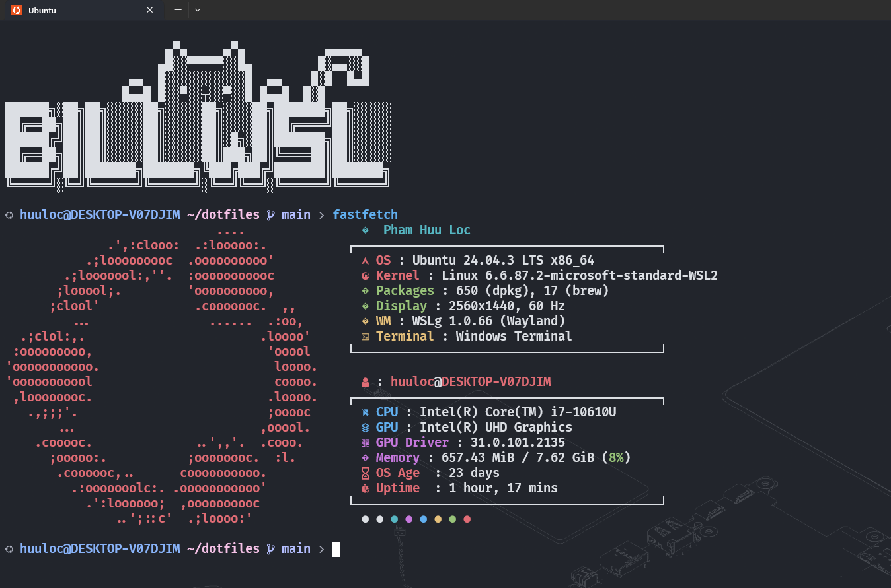

# WSL Ubuntu Terminal Setup

This repository contains configuration files for setting up a modern terminal environment in WSL Ubuntu with Zsh shell, Oh My Zsh, and Catppuccin theme.



## Features

- **Zsh Shell**: Powerful shell with Oh My Zsh framework
- **Oh My Zsh**: Framework with plugins and themes
- **Catppuccin Theme**: Beautiful mocha theme for Zsh
- **Zsh Plugins**: Autosuggestions and syntax highlighting
- **Fastfetch**: A fast system information fetcher (installed from GitHub releases)
- **Docker**: Container platform for development
- **nvm & Node.js**: Node Version Manager with LTS
- **Homebrew**: Package manager for macOS/Linux
- **uv**: Fast Python package manager
- **Modern Tools**: Includes Neovim, Lsd, Bat, and other useful terminal tools

## Quick Start

1. **Install WSL (if you haven't already):**

   - Open PowerShell as Administrator and run:
     ```powershell
     wsl --install
     ```
   - Restart your computer if prompted.
   - After installation, open "Ubuntu" from the Start Menu to complete the setup.

2. **Clone this repository:**
   ```bash
   git clone https://github.com/phamhuulocforwork/dotfiles.git
   cd dotfiles
   ```

3. **Run the installation script:**
   ```bash
   sh install.sh
   ```
   *Or if sh is not available:*
   ```bash
   bash install.sh
   ```

4. **Restart your terminal** or run:
   ```bash
   source ~/.zshrc
   ```
   *Or to use Zsh shell:*
   ```bash
   zsh
   ```

5. **Configure Git (optional):**
   Edit `~/.gitconfig` with your name and email:
   ```bash
   git config --global user.name "Your Name"
   git config --global user.email "your.email@example.com"
   ```

## Installed Packages

### Core Terminal Tools
- **Zsh**: Powerful shell with Oh My Zsh framework
- **Oh My Zsh**: Framework with plugins and themes
- **Catppuccin Theme**: Beautiful mocha theme
- **Zsh Plugins**: Autosuggestions and syntax highlighting
- **Fastfetch**: System information display (installed from GitHub releases)

### Development Tools
- **Neovim**: Modern text editor
- **Git**: Version control system
- **Docker**: Container platform (manual installation required)
- **nvm & Node.js**: Node Version Manager with LTS
- **Homebrew**: Package manager
- **uv**: Fast Python package manager

### Enhanced CLI Tools
- **Lsd**: Modern `ls` replacement with icons
- **Bat**: Enhanced `cat` with syntax highlighting
- **Btop**: Modern system monitor
- **Tree**: Directory tree viewer
- **Unzip**: Archive extraction utility
- **Fzf**: Fuzzy finder
- **Ripgrep**: Fast text search
- **Fd**: Modern `find` replacement

### Additional Tools
- **Jq**: JSON processor
- **P7zip**: Archive utilities
- **Unzip**: Archive extraction utility
- **Openssh-client**: SSH client
- **Build-essential**: C/C++ development tools

## Configuration Files

- `~/.zshrc`: Zsh shell configuration with Oh My Zsh
- `~/.zsh_aliases`: Custom aliases for Zsh
- `~/.bashrc`: Bash fallback configuration
- `~/.gitconfig`: Git configuration

## Customization

### Zsh Shell
Edit `~/.zshrc` to customize your Zsh shell experience. The configuration includes Oh My Zsh framework with Catppuccin theme.

### Oh My Zsh Theme
The setup installs Catppuccin mocha theme. You can change the theme by modifying `ZSH_THEME` in `~/.zshrc`:
```bash
ZSH_THEME="agnoster"  # Change to any Oh My Zsh theme
```

### Catppuccin Flavor
You can change the Catppuccin flavor by modifying `CATPPUCCIN_FLAVOR` in `~/.zshrc`:
```bash
CATPPUCCIN_FLAVOR="latte"  # Options: frappe, latte, macchiato, mocha
```

### Zsh Plugins
Additional plugins can be added to the `plugins` array in `~/.zshrc`:
```bash
plugins=(
    git
    zsh-autosuggestions
    zsh-syntax-highlighting
    docker
    # Add more plugins here
)
```

### Fastfetch
Edit `~/.config/fastfetch/config.jsonc` to customize the system information display.

## Troubleshooting

### Zsh Shell Not Working
If Zsh shell doesn't start automatically, run:
```bash
chsh -s /usr/bin/zsh
```

### Oh My Zsh Not Working
Make sure Oh My Zsh is installed and the configuration file exists:
```bash
ls ~/.oh-my-zsh/oh-my-zsh.sh
```

### Catppuccin Theme Not Loading
Check if the theme file exists and Zsh can find it:
```bash
ls ~/.oh-my-zsh/themes/catppuccin.zsh-theme
```

### Zsh Plugins Not Working
Check if plugins are installed in the correct directory:
```bash
ls ~/.oh-my-zsh/plugins/zsh-autosuggestions/
ls ~/.oh-my-zsh/plugins/zsh-syntax-highlighting/
```

### Fastfetch Not Working
Check if fastfetch is installed and configured:
```bash
fastfetch --version
```

## Project Structure

```
├── install.sh                    # Main installation script
├── README.md                     # This file
├── builder/                      # Python builder scripts
│   ├── install.py               # Main builder logic
│   ├── packages.py              # Package definitions
│   ├── managers/                 # Manager modules
│   │   ├── filesystem_manager.py
│   │   ├── package_manager.py
│   │   └── post_install_manager.py
│   └── utils/
│       └── schemes.py           # Data structures
└── home/                        # Configuration files
    ├── .zshrc                   # Zsh shell configuration
    ├── .zsh_aliases             # Zsh aliases
    ├── .bashrc                  # Bash fallback configuration
    ├── .gitconfig               # Git configuration
    └── .config/
        └── fastfetch/           # Fastfetch config
```

## License

This project is open source and available under the [MIT License](LICENSE).

## Contributing

Contributions are welcome! Please feel free to submit a Pull Request.